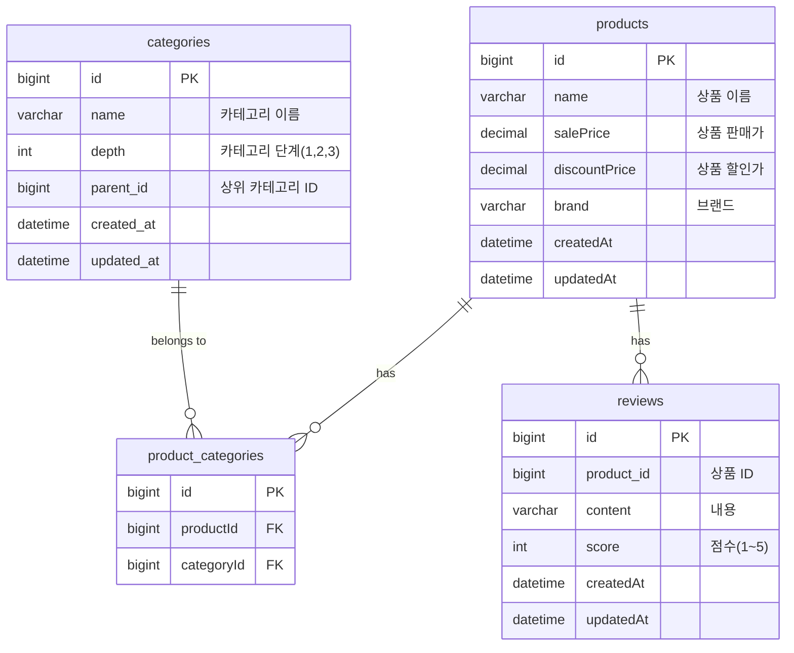
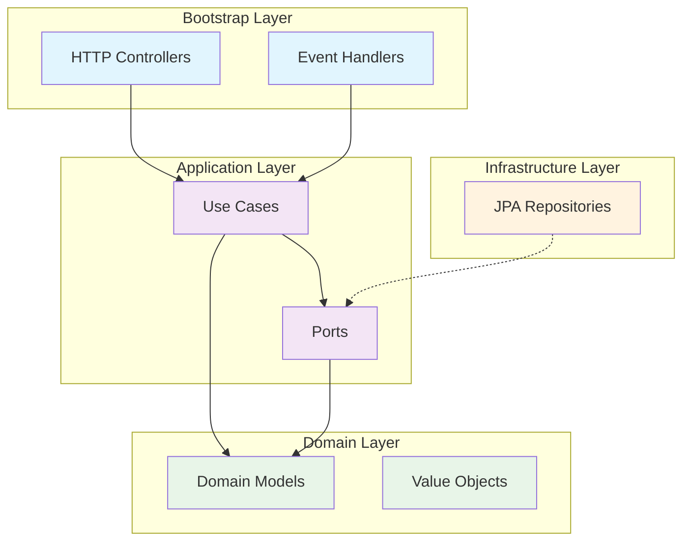

# 펫프렌즈 백엔드 채용 과제

자바, 스프링부트, JPA를 사용한 상품/리뷰 서비스입니다.


<br/>

## 기술스택


<br/>

## 실행하는 방법

### 1. 프로젝트 클론

```bash
git clone https://github.com/jincrates-lee/pf-assignment.git
cd pf-assignment
```

### 2. 프로젝트 빌드

```bash
./gradlew bootRun
```

### 3. API 문서 확인

애플리케이션 실행 후 다음 URL에서 Swagger UI를 통해 API를 확인하고 테스트할 수 있습니다.

- **Swagger UI**: [http://localhost:8090/swagger-ui/index.html](http://localhost:8090/swagger-ui/index.html)
- **API Docs**: [http://localhost:8090/v3/api-docs](http://localhost:8090/v3/api-docs)

### 4. H2 Database Console

- **H2 Console**: [http://localhost:8090/h2-console](http://localhost:8090/h2-console)
- **JDBC URL**: `jdbc:h2:mem:testdb`
- **Username**: `sa`
- **Password**: (없음)

<br/>

## ERD 설계



<details>
<summary>ERD에 대한 TMI</summary>
<div markdown="1">

### 1. 상품과 카테고리는 다대다 관계
상품에는 여러 카테고리를 가질 수 있기 때문에 `상품`과 `카테고리`를 다대다 관계로 설계하였고, 중간에 `상품 카테고리`라는 매핑 테이블을 설계하였습니다.

**장점**: 하나의 상품이 여러 카테고리에 동시에 노출될 수 있어 검색 접근성이 향상되며, 카테고리별 마케팅 전략 수립이 용이합니다. 또한 정규화를 통해 데이터 중복을 방지하고 카테고리 변경 시 일관성을 보장할 수 있습니다.

### 2. 계층형 카테고리
카테고리는 계층형 구조로 만들기 위해 자기 참조를 통해 depth를 구분하도록 설계했습니다. 요구사항에서는 3depth까지 카테고리 구조를 가지지만, 이후의 depth도 확장이 가능한 구조입니다.
  
**장점**: depth 필드를 통해 카테고리 레벨별 조회 성능이 최적화되며, 브레드크럼 네비게이션 구현이 쉬워집니다. 확장 가능한 구조로 비즈니스 요구사항 변경에 유연하게 대응할 수 있고, 카테고리 트리 구조 탐색 시 효율적인 쿼리 작성이 가능합니다.
### 3. 리뷰와 상품의 관계를 최소화
리뷰는 상품 ID만을 가지도록 설계를 하였고, 상품에 대한 리뷰 수나 평균 점수는 별도 컬럼을 만들지 않고 group by를 하여 조회하도록 하였습니다.

**장점**: 데이터 정합성을 보장하여 리뷰 데이터와 통계 정보 간의 불일치 문제를 원천 차단할 수 있습니다. 별도의 배치 작업이나 트리거 없이도 항상 최신의 정확한 통계를 제공하며, 저장 공간을 절약하고 데이터 동기화 복잡성을 제거할 수 있습니다. 또한 리뷰 삭제/수정 시 별도의 통계 업데이트 로직이 불필요하여 시스템 복잡도가 감소합니다.
</div>
</details>

<br/>

## 아키텍처 설계

클린 아키텍처를 도입하여 도메인 중심의 견고하고 확장 가능한 시스템을 구축했습니다.




| **계층** | **설명** |
|----|---------------|
| Bootstrap Layer | HTTP, 이벤트, 스케줄러 등 외부 트리거를 받아 애플리케이션을 연결하는 진입점(http, event listener) |
| Application Layer | 비즈니스 유즈케이스를 통해 도메인 객체들을 협력시키는 계층(usecase, port)  |
| Domain Layer | 핵심 비즈니스 로직과 규칙이 담긴 계층  |
| Infrastructure Layer | 기술적 구현 세부사항을 담당하는 계층(port의 실제 구현체)   |


<details>
<summary>왜 클린 아키텍처인가?</summary>
<div markdown="1">

### 의존성 역전을 통한 도메인 보호
- 인터페이스를 활용해 도메인 계층이 외부 기술에 의존하지 않도록 설계
- 도메인 로직이 순수하게 비즈니스 규칙에만 집중할 수 있는 환경 조성
- 외부 라이브러리나 프레임워크 변경 시에도 핵심 비즈니스 로직에 영향 없음

### 도메인 모델과 JPA 엔티티 분리의 효과
- 도메인 모델은 비즈니스 로직 표현에 최적화된 순수한 형태로 설계
- JPA 엔티티는 데이터 영속성에만 집중하여 각각의 책임이 명확히 분리
- ORM 제약사항이나 데이터베이스 스키마 변경이 도메인 모델에 영향을 주지 않음
- 비즈니스 요구사항 변경과 데이터 모델 변경을 독립적으로 대응 가능

### 계층별 Mapper를 통한 관심사 분리
- 각 계층에 최적화된 데이터 구조로 역할과 책임을 명확히 구분
- 도메인 모델, 영속성 엔티티, API 응답 객체 간의 변환을 체계적으로 관리
- 계층 간 데이터 전달 시 불필요한 정보 노출 방지 및 보안 강화
- 각 계층별 요구사항 변경 시 다른 계층에 미치는 영향 최소화

### 테스트 용이성과 유지보수성 향상
- Mock 객체를 활용한 단위 테스트가 용이한 구조
- 비즈니스 로직 테스트 시 외부 의존성(DB, API 등) 없이 독립적 검증 가능
- 계층별 책임이 명확하여 버그 발생 시 원인 추적과 수정 범위 특정이 용이
</div>
</details>

<br/>

## 디렉토리 구조

```text
src/main/java
└── me
    └── jincrates
        └── pf
            └── assignment
                ├── Application.java                - 애플리케이션 실행
                ├── application                     
                │   ├── UseCase.java                - 유즈케이스(usecase) 인터페이스
                │   ├── dto                         - Request/Response DTO 객체
                │   ├── repository                  - 포트(port) 인터페이스
                │   └── service                     - 유즈케이스 구현체, 트랜잭션 처리
                ├── bootstrap 
                │   ├── handler                     - 스프링이벤트 핸들러
                │   └── http                        - REST API 엔드포인트(HTTP 요청/응답 처리)
                │       └── docs                    - Swagger/OpenAPI 스펙 정의
                ├── domain
                │   ├── event                       - 도메인 이벤트 정의
                │   ├── exception                   - 비즈니스, 서버 커스텀 예외
                │   ├── model                       - 도메인 모델(비즈니스 규칙과 불변성 보장)
                │   └── vo                          - 값 객체(Value Object), 불변성 보장
                ├── infrastructure
                │   └── persistence
                │       └── jpa
                │           ├── PortAdapter.java    - 어댑터: 포트(port) 구현체
                │           ├── entity              - JPA 엔티티
                │           ├── mapper              - JPA 엔티티와 도메인 모델 간 매핑
                │           └── repository          - JPA 레포지토리
                └── shared
                    ├── config                      - 프로젝트 설정 관련
                    └── util                        - 유틸클래스
```

<br/>

## API Reference
Swagger 확인이 어렵다면, [API 문서](https://github.com/jincrates-lee/pf-assignment/blob/feature/refactoring/docs/API_REFERENCE.md)를 참고하시길 바랍니다.

<br/>

## 과제에 대한 회고

### 목표 달성도
ㅁㄴㅇㄹ

### 문제 해결 과정
ㅁㄴㅇㄹ

### 새롭게 도전한 부분
ㅁㄴㅇㄹ

### 보완이 필요한 점
ㅁㄴㅇㄹ
