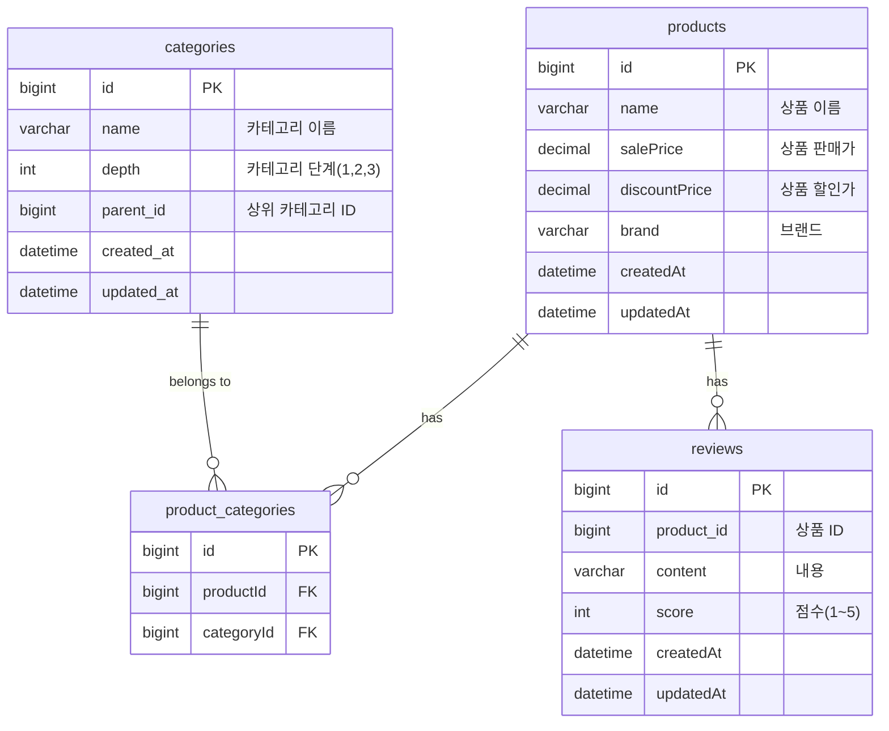
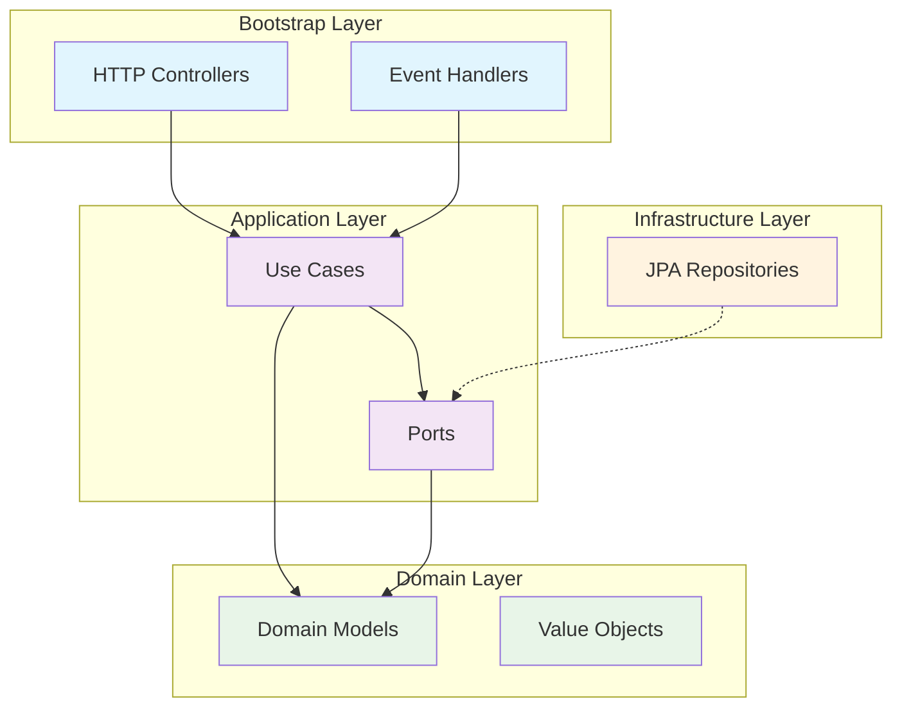

# 펫프렌즈 백엔드 채용 과제

자바, 스프링부트, JPA를 사용한 상품/리뷰 서비스입니다.


<br/>

## 기술스택


<br/>

## 실행하는 방법

### 1. 프로젝트 클론

```bash
git clone https://github.com/jincrates-lee/pf-assignment.git
cd pf-assignment
```

### 2. 프로젝트 빌드

```bash
./gradlew bootRun
```

### 3. API 문서 확인

애플리케이션 실행 후 다음 URL에서 Swagger UI를 통해 API를 확인하고 테스트할 수 있습니다.

- **Swagger UI**: [http://localhost:8090/swagger-ui/index.html](http://localhost:8090/swagger-ui/index.html)
- **API Docs**: [http://localhost:8090/v3/api-docs](http://localhost:8090/v3/api-docs)

### 4. H2 Database Console

- **H2 Console**: [http://localhost:8090/h2-console](http://localhost:8090/h2-console)
- **JDBC URL**: `jdbc:h2:mem:testdb`
- **Username**: `sa`
- **Password**: (없음)

<br/>

## ERD 설계



<br/>

## 아키텍처 설계

- **Bootstrap Layer**: HTTP, 이벤트, 스케줄러 등 외부 트리거를 받아 애플리케이션을 연결하는 진입점(http, event listener)
- **Application Layer**: 비즈니스 유즈케이스를 통해 도메인 객체들을 협력시키는 계층(usecase, port)
  - usecase: 특정 비즈니스 시나리오, 트랜잭션 처리
  - port: 외부와의 계약 인터페이스
- **Domain Layer**: 핵심 비즈니스 로직과 규칙이 담긴 계층
- **Infrastructure Layer**: 기술적 구현 세부사항을 담당하는 계층(port의 실제 구현체)

<br/>

## 디렉토리 구조

```text
src/main/java
└── me
    └── jincrates
        └── pf
            └── assignment
                ├── Application.java                - 애플리케이션 실행
                ├── application                     
                │   ├── UseCase.java                - 유즈케이스(usecase) 인터페이스
                │   ├── dto                         - Request/Response DTO 객체
                │   ├── repository                  - 포트(port) 인터페이스
                │   └── service                     - 유즈케이스 구현체, 트랜잭션 처리
                ├── bootstrap 
                │   ├── handler                     - 스프링이벤트 핸들러
                │   └── http                        - REST API 엔드포인트(HTTP 요청/응답 처리)
                │       └── docs                    - Swagger/OpenAPI 스펙 정의
                ├── domain
                │   ├── event                       - 도메인 이벤트 정의
                │   ├── exception                   - 비즈니스, 서버 커스텀 예외
                │   ├── model                       - 도메인 모델(비즈니스 규칙과 불변성 보장)
                │   └── vo                          - 값 객체(Value Object), 불변성 보장
                ├── infrastructure
                │   └── persistence
                │       └── jpa
                │           ├── PortAdapter.java    - 어댑터: 포트(port) 구현체
                │           ├── entity              - JPA 엔티티
                │           ├── mapper              - JPA 엔티티와 도메인 모델 간 매핑
                │           └── repository          - JPA 레포지토리
                └── shared
                    ├── config                      - 프로젝트 설정 관련
                    └── util                        - 유틸클래스
```
<br/>

## API Reference
### 상품 등록 API
```http request
POST http://localhost:8090/api/products
Content-Type: application/json
```
#### Request
```json
{
  "name": "촉촉트릿 북어 80g",
  "sellingPrice": 15000,
  "discountPrice": 2100,
  "brand": "촉촉트릿",
  "categoryIds": [1, 2, 3]
}
```
- `name`: 상품 이름은 필수입니다. (공백 불가)
- `sellingPrice`: 상품 판매가는 필수이며 0원보다 커야합니다.
- `discountPrice`: 상품 할인가는 필수이며 0원 이상이여야 합니다.
- `brand`: 상품 브랜드는 필수입니다. (공백 불가)
- `categoryIds`: 상품 카테고리 목록은 필수입니다. (빈 배열 불가)

#### Response
```json
{
  "success": true,
  "message": null,
  "data": {
    "productId": 1
  }
}
```

### 상품 수정 API
```http request
PATCH http://localhost:8090/api/products/{productId}
Content-Type: application/json
```

#### Request
```json
{
  "name": "촉촉트릿 북어 80g (수정)",
  "sellingPrice": 16000,
  "discountPrice": 2500,
  "brand": "촉촉트릿",
  "categoryIds": [1, 3]
}
```
- 상품 등록과 동일한 검증 규칙 적용
- productId: Path Variable로 전달되는 상품 ID

#### Response
```json
{
  "success": true,
  "message": null,
  "data": {
    "productId": 3
  }
}
```
### 상품 삭제 API
```http request
DELETE http://localhost:8090/api/products/{productId}
```

#### Request
- Path Variable: (Long) `productId`


#### Response
```json
{
  "success": true,
  "message": null,
  "data": null
}
```
<br/>

### XX API
GET http://localhost:8090/api/
Content-Type: application/json

#### Request
```json
{
}
```

#### Response
```json
{
}
```


## 과제를 하면서

### 신경쓴 부분

### 보완이 필요한 점
