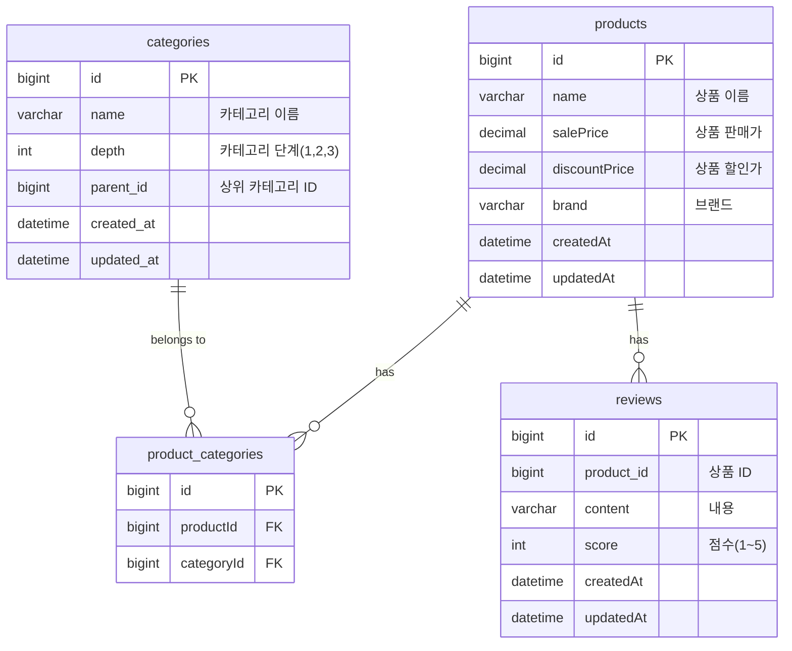
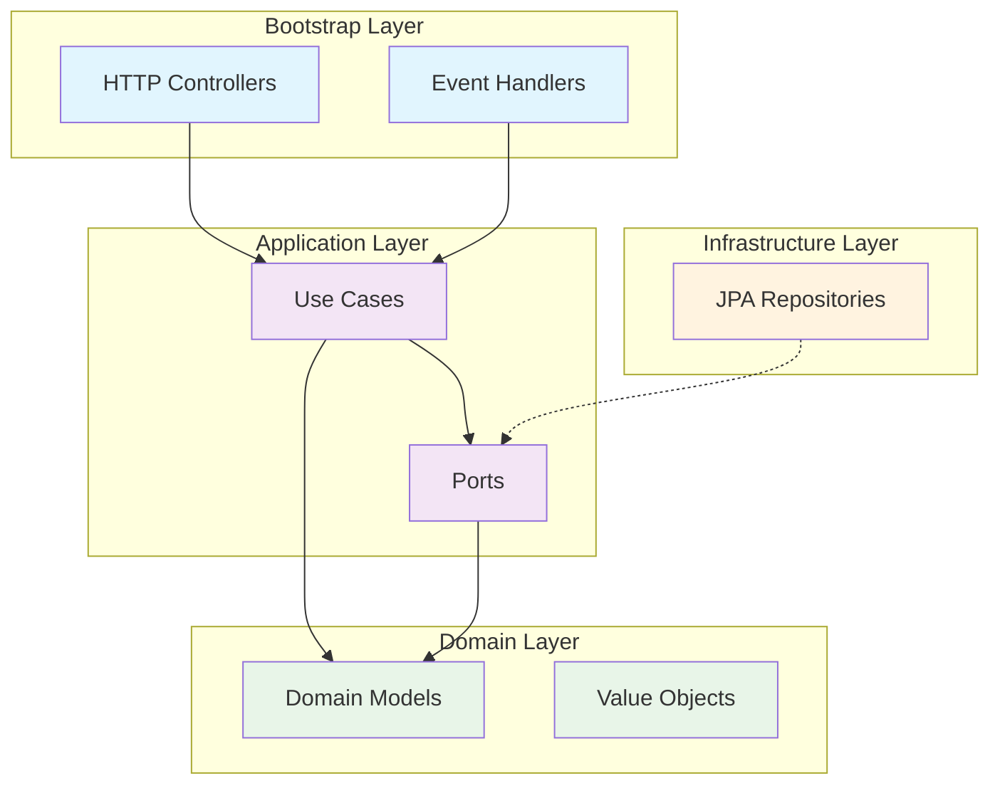
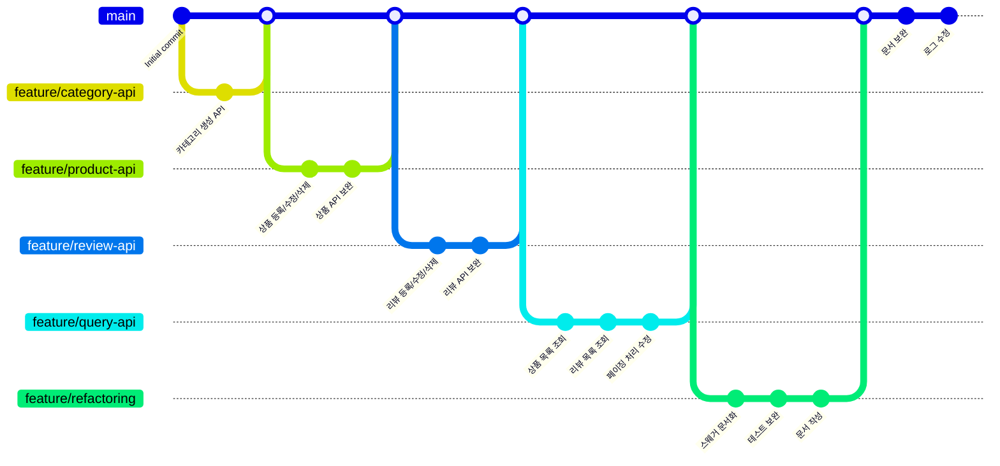
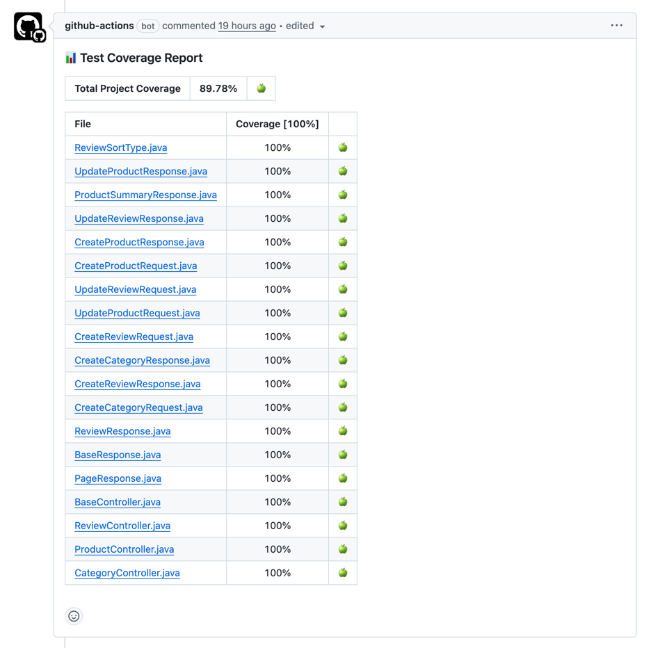

# 펫프렌즈 백엔드 채용 과제 
지원자: 이진규(jg.lee@pet-friends.co.kr)

자바, 스프링부트, JPA를 사용한 상품/리뷰 서비스입니다. [과제 전문](https://github.com/jincrates-lee/pf-assignment/blob/feature/refactoring/docs/ASSIGNMENT.md)


<br/>

## 기술스택


<br/>

## 실행하는 방법

### 1. 프로젝트 클론

```bash
git clone https://github.com/jincrates-lee/pf-assignment.git
cd pf-assignment
```

### 2. 프로젝트 빌드

```bash
./gradlew bootRun
```

### 3. API 문서 확인

애플리케이션 실행 후 다음 URL에서 Swagger UI를 통해 API를 확인하고 테스트할 수 있습니다.

- **Swagger UI**: [http://localhost:8090/swagger-ui/index.html](http://localhost:8090/swagger-ui/index.html)
- **API Docs**: [http://localhost:8090/v3/api-docs](http://localhost:8090/v3/api-docs)

### 4. H2 Database Console

- **H2 Console**: [http://localhost:8090/h2-console](http://localhost:8090/h2-console)
- **JDBC URL**: `jdbc:h2:mem:testdb`
- **Username**: `sa`
- **Password**: (없음)

<br/>

## ERD 설계



<details>
<summary>ERD에 대한 TMI</summary>
<div markdown="1">

### 1. 상품과 카테고리는 다대다 관계
상품에는 여러 카테고리를 가질 수 있기 때문에 `상품`과 `카테고리`를 다대다 관계로 설계하였고, 중간에 `상품 카테고리`라는 매핑 테이블을 설계하였습니다.

**장점**: 하나의 상품이 여러 카테고리에 동시에 노출될 수 있어 검색 접근성이 향상되며, 카테고리별 마케팅 전략 수립이 용이합니다. 또한 정규화를 통해 데이터 중복을 방지하고 카테고리 변경 시 일관성을 보장할 수 있습니다.

### 2. 계층형 카테고리
카테고리는 계층형 구조로 만들기 위해 자기 참조를 통해 depth를 구분하도록 설계했습니다. 요구사항에서는 3depth까지 카테고리 구조를 가지지만, 이후의 depth도 확장이 가능한 구조입니다.
  
**장점**: depth 필드를 통해 카테고리 레벨별 조회 성능이 최적화되며, 브레드크럼 네비게이션 구현이 쉬워집니다. 확장 가능한 구조로 비즈니스 요구사항 변경에 유연하게 대응할 수 있고, 카테고리 트리 구조 탐색 시 효율적인 쿼리 작성이 가능합니다.
### 3. 리뷰와 상품의 관계를 최소화
리뷰는 상품 ID만을 가지도록 설계를 하였고, 상품에 대한 리뷰 수나 평균 점수는 별도 컬럼을 만들지 않고 group by를 하여 조회하도록 하였습니다.

**장점**: 데이터 정합성을 보장하여 리뷰 데이터와 통계 정보 간의 불일치 문제를 원천 차단할 수 있습니다. 별도의 배치 작업이나 트리거 없이도 항상 최신의 정확한 통계를 제공하며, 저장 공간을 절약하고 데이터 동기화 복잡성을 제거할 수 있습니다. 또한 리뷰 삭제/수정 시 별도의 통계 업데이트 로직이 불필요하여 시스템 복잡도가 감소합니다.
</div>
</details>

<br/>

## 아키텍처 설계

클린 아키텍처를 도입하여 도메인 중심의 견고하고 확장 가능한 시스템을 구축했습니다.




| **계층** | **설명** |
|----|---------------|
| Bootstrap Layer | HTTP, 이벤트, 스케줄러 등 외부 트리거를 받아 애플리케이션을 연결하는 진입점(http, event listener) |
| Application Layer | 비즈니스 유즈케이스를 통해 도메인 객체들을 협력시키는 계층(usecase, port)  |
| Domain Layer | 핵심 비즈니스 로직과 규칙이 담긴 계층  |
| Infrastructure Layer | 기술적 구현 세부사항을 담당하는 계층(port의 실제 구현체)   |


<details>
<summary>왜 클린 아키텍처인가?</summary>
<div markdown="1">

### 의존성 역전을 통한 도메인 보호
- 인터페이스를 활용해 도메인 계층이 외부 기술에 의존하지 않도록 설계
- 도메인 로직이 순수하게 비즈니스 규칙에만 집중할 수 있는 환경 조성
- 외부 라이브러리나 프레임워크 변경 시에도 핵심 비즈니스 로직에 영향 없음

### 도메인 모델과 JPA 엔티티 분리의 효과
- 도메인 모델은 비즈니스 로직 표현에 최적화된 순수한 형태로 설계
- JPA 엔티티는 데이터 영속성에만 집중하여 각각의 책임이 명확히 분리
- ORM 제약사항이나 데이터베이스 스키마 변경이 도메인 모델에 영향을 주지 않음
- 비즈니스 요구사항 변경과 데이터 모델 변경을 독립적으로 대응 가능

### 계층별 Mapper를 통한 관심사 분리
- 각 계층에 최적화된 데이터 구조로 역할과 책임을 명확히 구분
- 도메인 모델, 영속성 엔티티, API 응답 객체 간의 변환을 체계적으로 관리
- 계층 간 데이터 전달 시 불필요한 정보 노출 방지 및 보안 강화
- 각 계층별 요구사항 변경 시 다른 계층에 미치는 영향 최소화

### 테스트 용이성과 유지보수성 향상
- Mock 객체를 활용한 단위 테스트가 용이한 구조
- 비즈니스 로직 테스트 시 외부 의존성(DB, API 등) 없이 독립적 검증 가능
- 계층별 책임이 명확하여 버그 발생 시 원인 추적과 수정 범위 특정이 용이
</div>
</details>

<br/>

## 디렉토리 구조

```text
src/main/java
└── me
    └── jincrates
        └── pf
            └── assignment
                ├── Application.java                - 애플리케이션 실행
                ├── application                     
                │   ├── UseCase.java                - 유즈케이스(usecase) 인터페이스
                │   ├── dto                         - Request/Response DTO 객체
                │   ├── repository                  - 포트(port) 인터페이스
                │   └── service                     - 유즈케이스 구현체, 트랜잭션 처리
                ├── bootstrap 
                │   ├── handler                     - 스프링이벤트 핸들러
                │   └── http                        - REST API 엔드포인트(HTTP 요청/응답 처리)
                │       └── docs                    - Swagger/OpenAPI 스펙 정의
                ├── domain
                │   ├── event                       - 도메인 이벤트 정의
                │   ├── exception                   - 비즈니스, 서버 커스텀 예외
                │   ├── model                       - 도메인 모델(비즈니스 규칙과 불변성 보장)
                │   └── vo                          - 값 객체(Value Object), 불변성 보장
                ├── infrastructure
                │   └── persistence
                │       └── jpa
                │           ├── PortAdapter.java    - 어댑터: 포트(port) 구현체
                │           ├── entity              - JPA 엔티티
                │           ├── mapper              - JPA 엔티티와 도메인 모델 간 매핑
                │           └── repository          - JPA 레포지토리
                └── shared
                    ├── config                      - 프로젝트 설정 관련
                    └── util                        - 유틸클래스
```

<br/>

## Git Branch 전략
- main, feature를 구분하여 main 브랜치는 항상 배포 가능한 상태를 유지하였습니다. 
- 작업 브랜치는 `feature/` 접두사를 사용하여 기능별로 독립적인 브랜치를 생성하였습니다.



<br/>

## API Reference
Swagger 확인이 어렵다면, [API 문서](https://github.com/jincrates-lee/pf-assignment/blob/feature/refactoring/docs/API_REFERENCE.md)를 참고하시길 바랍니다.

<br/>

## 과제에 대한 회고

### 목표 달성 체크리스트
#### 필수 요구사항
- [x] JAVA 17, Spring Boot 3, Gradle, JPA -> [build.gradle](https://github.com/jincrates-lee/pf-assignment/blob/main/build.gradle)
- [x] DB 는 H2 를 사용해주세요. -> [build.gradle](https://github.com/jincrates-lee/pf-assignment/blob/main/build.gradle)
- [x] API 명세는 Swagger 로 확인할 수 있어야 합니다. -> [Swagger API 명세 인터페이스](https://github.com/jincrates-lee/pf-assignment/tree/main/src/main/java/me/jincrates/pf/assignment/bootstrap/http/docs)
- [x] Swagger 환경에서 API 테스트가 가능해야 합니다. -> [API 문서 확인](https://github.com/jincrates-lee/pf-assignment?tab=readme-ov-file#3-api-%EB%AC%B8%EC%84%9C-%ED%99%95%EC%9D%B8)
- [x] 단위 테스트코드를 작성해주세요. -> [UseCase 중심 단위테스트 작성](https://github.com/jincrates-lee/pf-assignment/tree/main/src/test/java/me/jincrates/pf/assignment/application/service), [API 통합 테스트 추가](https://github.com/jincrates-lee/pf-assignment/tree/main/src/test/java/me/jincrates/pf/assignment/bootstrap/http)
- [x] `README.md` 작성해주세요. (실행방법, swagger 주소 등) -> [READEME.md](https://github.com/jincrates-lee/pf-assignment/blob/main/README.md)
- [x] API가 정상적으로 작동해야합니다 -> swagger에서 호출하여 확인 or [인텔리제이 http 실행 가능](https://github.com/jincrates-lee/pf-assignment/tree/main/docs/http)
- [x] 유효성 검사가 적절하게 적용되어야합니다. -> [spring-validation을 통한 request 검증](https://github.com/jincrates-lee/pf-assignment/tree/main/src/main/java/me/jincrates/pf/assignment/application/dto), [도메인 객체 생성자 유효성 검증](https://github.com/jincrates-lee/pf-assignment/tree/main/src/main/java/me/jincrates/pf/assignment/domain/model)

#### 구현 요구사항
- [x] 상품 등록 시 `상품명` / `판매가격` / `할인가격` / `브랜드` / `카테고리정보`를 설정할 수 있다.
- [x] 상품에는 여러개의 `카테고리정보`가 매핑될 수 있다. - [ProductService.create()](https://github.com/jincrates-lee/pf-assignment/blob/1261f26ada3bf8a8c0f9da3b85e9905867d2c8f4/src/main/java/me/jincrates/pf/assignment/application/service/ProductService.java#L45)
- [x] 상품 삭제시 해당 상품에 연관된 리뷰 정보도 함께 삭제된다 -> [ProductDeletedEventReviewHandler 이벤트로 비동기 처리](https://github.com/jincrates-lee/pf-assignment/blob/main/src/main/java/me/jincrates/pf/assignment/bootstrap/handler/ProductDeletedEventReviewHandler.java)
- [x] 카테고리정보를 기준으로 상품목록을 조회한다. -> [카테고리별 상품 목록 조회 API](https://github.com/jincrates-lee/pf-assignment/blob/1261f26ada3bf8a8c0f9da3b85e9905867d2c8f4/src/main/java/me/jincrates/pf/assignment/bootstrap/http/docs/ProductControllerDocs.java#L58)
- [x] 정렬은 `낮은가격순` / `리뷰많은순` 두 가지 정렬기준을 제공한다. -> 위와 동일
- [x] 상품 응답에는 `상품명` / `판매가격` / `할인가격` / `브랜드` / `할인율` / `리뷰평점` / `카테고리정보`가 있다 -> 위와 동일
  - [x] 할인율은 소수점 첫번째자리에서 반올림한다. -> [상품 도메인 객체에서 계산](https://github.com/jincrates-lee/pf-assignment/blob/1261f26ada3bf8a8c0f9da3b85e9905867d2c8f4/src/main/java/me/jincrates/pf/assignment/domain/model/Product.java#L43)
  - [x] 할인율 = 할인가 / 판매가 * 100 -> 위와 동일
  - [x] 리뷰평점은 소수점 둘째자리에서 반올림한다. -> [상품별 리뷰 평균 조회 Map 생성](https://github.com/jincrates-lee/pf-assignment/blob/1261f26ada3bf8a8c0f9da3b85e9905867d2c8f4/src/main/java/me/jincrates/pf/assignment/infrastructure/persistence/jpa/ReviewRepositoryAdapter.java#L93)
  - [x] 카테고리정보는 상품에 연결된 모든 카테고리정보를 응답해야한다.
- [x] 리뷰는 `상품ID` / `내용`/ `리뷰점수`를 등록한다. -> [리뷰 등록 API](https://github.com/jincrates-lee/pf-assignment/blob/1261f26ada3bf8a8c0f9da3b85e9905867d2c8f4/src/main/java/me/jincrates/pf/assignment/bootstrap/http/docs/ReviewControllerDocs.java#L24)
- [x] 리뷰는 `내용`/ `리뷰점수`만 수정 가능하다. -> [리뷰 수정 API](https://github.com/jincrates-lee/pf-assignment/blob/1261f26ada3bf8a8c0f9da3b85e9905867d2c8f4/src/main/java/me/jincrates/pf/assignment/bootstrap/http/docs/ReviewControllerDocs.java#L33)
- [x] 리뷰점수는 1~5점까지 정할 수 있다. -> [request 검증](https://github.com/jincrates-lee/pf-assignment/blob/1261f26ada3bf8a8c0f9da3b85e9905867d2c8f4/src/main/java/me/jincrates/pf/assignment/application/dto/CreateReviewRequest.java#L20), [도메인에서 검증](https://github.com/jincrates-lee/pf-assignment/blob/1261f26ada3bf8a8c0f9da3b85e9905867d2c8f4/src/main/java/me/jincrates/pf/assignment/domain/model/Review.java#L30)
- [x] 상품ID를 기준으로 리뷰 목록을 조회한다. [상품별 리뷰 목록 조회 API](https://github.com/jincrates-lee/pf-assignment/blob/1261f26ada3bf8a8c0f9da3b85e9905867d2c8f4/src/main/java/me/jincrates/pf/assignment/bootstrap/http/docs/ProductControllerDocs.java#L77)
- [x] 리뷰는 기본 페이지당 5개씩 노출되어야 하고 노출 수는 변경될 수 있다. -> 위와 동일
- [x] 정렬은 `최근 등록순`으로 조회한다. -> 위와 동일
- [x] 리뷰 응답에는 `상품명` / `리뷰점수` / `내용`이 있다 -> [리뷰 응답 객체](https://github.com/jincrates-lee/pf-assignment/blob/main/src/main/java/me/jincrates/pf/assignment/application/dto/ReviewResponse.java)
- [x] 동시성을 고려한 설계 및 구현해주세요. -> 밑에 설명
- [ ] 대용량 트래픽과 마이크로서비스 환경을 고려하면 좋습니다.

### 문제 해결 과정

#### 1. 이벤트 기반 아키텍처 도입을 통한 시스템 결합도 완화
상품 삭제 시 연관된 리뷰 정보 삭제를 위해 이벤트 기반 비동기 처리 아키텍처를 도입했습니다. 상품 삭제 이벤트를 발행하여 리뷰 이벤트 리스너에서 처리함으로써 서비스 간 결합도를 낮추고 확장성을 높였습니다. 이를 통해 향후 MSA 환경에서도 쉽게 분리할 수 있는 구조를 구축했습니다.

#### 2. 동시성 제어를 위한 불변 객체 설계 및 데이터 일관성 보장
도메인 객체를 불변(Immutable) 객체로 설계하여 멀티스레드 환경에서의 안전성을 확보했습니다. 특히 상품의 리뷰 수나 평균 점수를 별도 컬럼으로 저장하지 않고 실시간 집계 쿼리 방식을 채택하여 데이터 정합성 문제를 원천 차단했습니다. 성능 최적화를 위해 상품 ID에 대한 인덱스를 전략적으로 배치하여 집계 쿼리 성능을 향상시켰습니다.

#### 3. 계층별 유효성 검증 전략을 통한 견고한 시스템 구축
다층 방어 전략을 통해 데이터 무결성을 보장했습니다. API 레벨에서는 Spring Validation으로 1차 검증을 수행하고, 도메인 레벨에서는 객체 생성 시점의 불변 조건을 강제하여 런타임 오류를 사전에 방지하는 구조를 설계했습니다. 이를 통해 Fail-Fast 원칙을 적용하여 시스템의 안정성을 크게 높였습니다.

#### 4. 포괄적 테스트 전략으로 코드 품질 보장
UseCase 중심의 비즈니스 로직 단위 테스트와 엔드투엔드 통합 테스트를 병행하여 테스트 피라미드를 완성했습니다. 특히 공통 유틸리티 클래스에 대한 철저한 테스트를 통해 재사용 가능한 컴포넌트의 신뢰성을 확보했습니다.

<br/>

### 새롭게 도전한 부분
#### 1. CI 파이프라인에서의 품질 관리 자동화
작업 초기에 테스트 커버리지를 주기적으로 확인하기 위해 jacoco-report를 추가하여 테스트 코드 커버리지 자동화를 구현하였습니다. 작성한 코드에 대한 테스트 커버리지는 80% 이상을 강제함으로써 지속적인 코드 품질 관리 체계를 구축하였습니다. 
 

#### 2. AI 기반 코드 품질 관리 시스템 도입
1인 개발의 한계를 극복하기 위해 Gemini Code Assist를 활용한 자동 코드 리뷰 시스템을 구축했습니다. PR 요약 자동화와 코드 리뷰 자동화를 통해 객관적인 코드 품질 검증이 가능했으며, 실제로 잠재적 버그를 사전에 발견하여 수정하는 성과를 달성했습니다. 이는 개발자 경험(DX) 향상과 동시에 코드 품질 보장이라는 두 마리 토끼를 잡은 혁신적인 접근이었습니다.
- [feat: 카테고리 생성 API 개발](https://github.com/jincrates-lee/pf-assignment/pull/1)
- [feat: 상품 등록/수정/삭제 API 개발](https://github.com/jincrates-lee/pf-assignment/pull/3)
- [feat: 리뷰 등록/수정/삭제 API 개발](https://github.com/jincrates-lee/pf-assignment/pull/4)
- [feat: 상품, 리뷰 목록 조회 API 추가](https://github.com/jincrates-lee/pf-assignment/pull/5)
- [refactor: 스웨거 문서화, 테스트 보완](https://github.com/jincrates-lee/pf-assignment/pull/6)

<br/>

### 보완이 필요한 점
#### 1. 성능 최적화 및 확장성 검증
실제 프로덕션 환경에서의 성능 테스트를 통한 병목 지점 식별 및 최적화를 계획하고 있습니다. 대용량 트래픽 상황에서의 시스템 안정성을 검증하여 엔터프라이즈급 서비스로의 발전 가능성을 탐색하고자 합니다.

#### 2. 마이크로서비스 아키텍처로의 진화
현재 상품과 리뷰에 대한 관계를 분리하기 위해 이벤트를 활용하였으나, 상품 목록 조회 부분에 대해 테이블 간 join 하는 부분이 들어가 있습니다. MSA 환경에서 상품과 리뷰에 대한 서비스가 분리될 수도 있다는 것을 고려한다면, 쿼리 join을 없애고 proxy 통신을 통해 필요한 데이터를 조회하여 이를 조합하는 방식으로 변경이 가능할 것 같습니다.   
